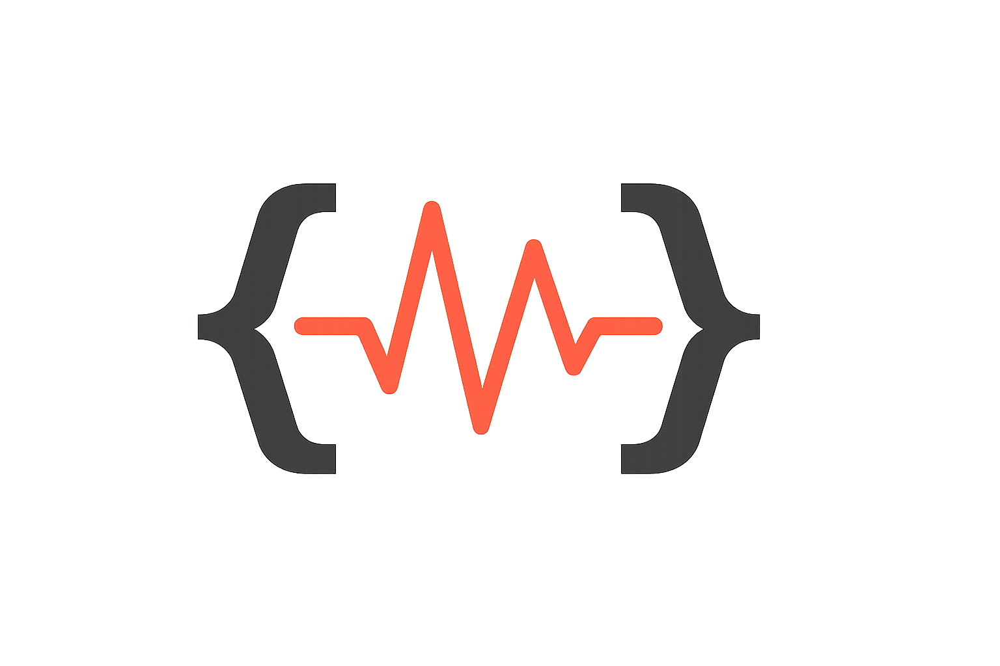

> [!NOTE]
> This is a personal project I’m using to learn and experiment (with some AI help). It’s not really maintained, doesn’t have a roadmap, and comes with no guarantees—use at your own risk.

<div align="center">



# ClaudePulse

**ClaudePulse maintains a steady pulse on your Claude Pro/Max sessions, automatically triggering new 5-hour cycles at reset boundaries to ensure you get every coding hour you pay for. Keep your development flow uninterrupted – ClaudePulse pulses in the background so you're always ready to code at full capacity.**

[](https://opensource.org/licenses/MIT)
[](https://nodejs.org/)
[](https://www.docker.com/)
[](https://github.com/substance0/claudepulse/releases)

[Installation](#installation) • [Features](#features) • [Configuration](#configuration) • [Support](#support) • [Changelog](#changelog) • [Contributing](#contributing) • [Licence](#licence)

</div>

## At a Glance

Here's the thing: Claude Code's 5-hour windows don't reset automatically when they expire. Each new window only starts when you send your first prompt after the reset time. The next limit is then computed based on your first prompt's hour (rounded down) + 5 hours. Miss that window, and you could lose precious coding hours when you finally sit down to work.

> [!WARNING]
> The "5-hour limit" can trigger before 5 actual hours due to token limits or other Claude-specific thresholds. See more details [on Claude's website](https://support.claude.com/en/articles/8324991-about-claude-s-pro-plan-usage).

### Real-World Scenario

| Time         | Without ClaudePulse                                                      | With ClaudePulse                                                         |
| ------------ | ------------------------------------------------------------------------ | ------------------------------------------------------------------------ |
| **9:00 AM**  | 🚀 Start coding, excited about your project                              | 🚀 Start coding, excited about your project                              |
| **11:00 AM** | 😱 _"5-hour limit reached • resets 2pm"_                                 | 😱 _"5-hour limit reached • resets 2pm"_                                 |
| **2:00 PM**  | ⏰ Reset time arrives, but you're in meetings                            | ⏰ Reset time arrives, but you're in meetings                            |
| **2:10 PM**  | 💼 Still in meetings...                                                  | ✅ **ClaudePulse sends pulse automatically**                             |
| **4:00 PM**  | 😞 Ready to code, but window starts NOW<br>_(Lost 2 hours you paid for)_ | 😎 Ready to code with **3h remaining**<br>_(Maximum subscription value)_ |

## Installation

<details open>
<summary><strong>🐳 Docker Registry (Recommended)</strong></summary>

**Authentication (once):** ClaudePulse runs Claude Code for each pulse, and Claude Code authenticates itself. Generate a long-lived token on any machine with a browser:

```bash
claude setup-token
```

It prints the token once and saves it nowhere. Store it in an env file, readable only by you:

```bash
echo "CLAUDE_CODE_OAUTH_TOKEN=<token>" > claudepulse.env && chmod 600 claudepulse.env
```

**Run:**

```bash
docker run -d --name claudepulse -e TZ=America/New_York --env-file claudepulse.env ghcr.io/substance0/claudepulse:latest
```

Passing the token through `--env-file` keeps it out of your shell history. The token is valid for one year.

**💡 Timezone (Optional):** Set the `TZ` environment variable to your local timezone for better log readability. Replace `America/New_York` with your timezone (e.g., `Europe/London`, `Asia/Tokyo`). Default is `UTC`. [Find your timezone](https://en.wikipedia.org/wiki/List_of_tz_database_time_zones).

**Stopping ClaudePulse:**

```bash
# Stop the container
docker stop claudepulse

# Remove the container (keeps volumes)
docker rm claudepulse
```

</details>

<details>
<summary><strong>🐳 Docker Compose (Alternative)</strong></summary>

**Download docker-compose.yml:**

```bash
# Download the compose file
curl -O https://raw.githubusercontent.com/substance0/claudepulse/main/docker-compose.yml

# Or clone the entire repository
git clone https://github.com/substance0/claudepulse.git
cd claudepulse
```

**Start with Docker Compose:**

```bash
docker-compose up -d
```

**💡 Timezone (Optional):** Edit `docker-compose.yml` to set the `TZ` environment variable to your local timezone for better log readability. Default is `UTC`.

**Authentication:** export `CLAUDE_CODE_OAUTH_TOKEN` (from `claude setup-token`, see above) in the shell that runs `docker-compose up`, or reference an env file from the service with `env_file:`.

**Stopping ClaudePulse:**

```bash
# Stop the Docker Compose stack
docker-compose down

# Or stop individual container
docker stop claudepulse
```

</details>

<details>
<summary><strong>💻 Local Development</strong></summary>

**Clone and Setup:**

```bash
git clone https://github.com/substance0/claudepulse.git
cd claudepulse
npm install
```

**Run with Node.js:**

```bash
npm start
```

**Or build and run locally with Docker:**

```bash
# Build from Dockerfile
docker-compose -f docker-compose.dev.yml up -d

# View logs
docker logs claudepulse-dev
```

**Requirements:** Node.js 18+ or Docker/Podman

---

**Authentication:** requires the Claude CLI on your `PATH`. Export `CLAUDE_CODE_OAUTH_TOKEN` from `claude setup-token` before `npm start`.

</details>

## Release Channels

| Tag                           | Published                  | Use                         |
| ----------------------------- | -------------------------- | --------------------------- |
| `latest`, `X.Y.Z`, `X.Y`, `X` | when a release is cut      | production                  |
| `edge`, `X.Y.Z-dev.N`         | every commit on `main`     | early access to merged work |
| `snapshot-<branch>`           | on demand, from any branch | testing a branch            |
| `sha-<commit>`                | every edge and release     | pinning an exact build      |

Build a snapshot of a branch (the branch must contain these workflows, so merge `main` into it first):

```bash
gh workflow run docker-snapshot.yml --ref <branch>
```

Rebuild the image of an existing release, if its build failed:

```bash
gh workflow run docker-release-rebuild.yml -f tag=vX.Y.Z
```

Every image carries build provenance. Verify one with:

```bash
gh attestation verify oci://ghcr.io/substance0/claudepulse:<tag> -R substance0/claudepulse
```

## Features

| Feature                            | Description                                                                                                                                                                                         |
| ---------------------------------- | --------------------------------------------------------------------------------------------------------------------------------------------------------------------------------------------------- |
| **Window-Aware Scheduling**        | Every pulse reports when the current 5-hour window resets; the next pulse lands just after it, so one pulse per window is enough                                                                    |
| **Docker & Compose Ready**         | One-command deployment; the token is the only state it needs                                                                                                                                        |
| **Claude Code Authentication**     | Runs Claude Code for each pulse, which authenticates itself from `CLAUDE_CODE_OAUTH_TOKEN`; ClaudePulse stores no credentials                                                                       |
| **Low-Cost Pulses**                | Each pulse runs the cheapest model with thinking disabled, in an isolated directory and configuration, and keeps the prompt cache warm                                                              |
| **Intelligent Scheduling**         | Follows the reported window, waits out usage limits, respects a configured start hour, and falls back to hourly pulses until a window is known ([see strategies details](docs/workflow-diagrams.md#3-scheduling-strategy-selection)) |
| **Immediate First Pulse**          | If the current 5-hour window cannot be detected, sends a pulse at startup to open a new window                                                                                                      |
| **Intelligent Retry with Backoff** | Exponential backoff (configurable multiplier & max delay) for transient failures; authentication failures are not retried                                                                           |
| **Spaced Failure Alerts**          | Discord alerts on the 1st, 2nd, 4th, 8th consecutive failure and so on, so a long outage stays visible without flooding the channel                                                                 |
| **No Runtime Dependencies**        | No npm runtime dependencies; relies on the Claude CLI included in the image                                                                                                                         |

## Configuration

ClaudePulse uses environment variables for configuration. All settings have sensible defaults.

For comprehensive configuration documentation, see [ENVIRONMENT.md](ENVIRONMENT.md).

### Essential Settings

| Variable      | Default  | Description                                  |
| ------------- | -------- | -------------------------------------------- |
| `PROMPT_TEXT` | `"ping"` | Pulse message sent to Claude                 |
| `MAX_RETRIES` | `3`      | Maximum retry attempts on failure            |
| `LOG_LEVEL`   | `INFO`   | Logging verbosity (ERROR, WARN, INFO, DEBUG) |
| `DRY_RUN`     | `false`  | Simulate pulses without sending to Claude    |

### Advanced Settings

| Variable                   | Default      | Description                          |
| -------------------------- | ------------ | ------------------------------------ |
| `RETRY_BACKOFF_MULTIPLIER` | `2`          | Exponential backoff multiplier       |
| `MAX_BACKOFF_MINUTES`      | `30`         | Maximum retry delay in minutes       |
| `NODE_ENV`                 | `production` | Environment mode                     |
| `DISCORD_WEBHOOK_URL`      | `unset`      | Discord webhook URL for error alerts |
| `DISCORD_WINDOW_WEBHOOK_URL` | `unset`    | Discord webhook announcing each window's reset time |

### Discord Notifications (Optional)

Get instant error alerts in Discord by setting up a webhook:

1. **Create webhook**: Discord Server → Settings → Integrations → Webhooks → New Webhook
2. **Copy webhook URL**
3. **Add to environment**:
   ```bash
   docker run -d --name claudepulse \
     --env-file claudepulse.env \
     ghcr.io/substance0/claudepulse:latest
   ```

Error notifications include error details, timestamp, and context. See [ENVIRONMENT.md](ENVIRONMENT.md#discord_webhook_url) for testing and advanced configuration.

## Support

- GitHub Issues: [Report bugs or request features](https://github.com/substance0/claudepulse/issues)
- Documentation: [Full documentation](https://github.com/substance0/claudepulse/wiki)
- Workflow Diagrams: [Visual process flows](docs/workflow-diagrams.md)

## Changelog

See [CHANGELOG.md](CHANGELOG.md) for a list of changes and version history.

## Contributing

Contributions are welcome! Please see [CONTRIBUTING.md](CONTRIBUTING.md) for detailed guidelines on how to contribute to ClaudePulse.

## License

This project is licensed under the MIT License - see the [LICENSE](LICENSE) file for details.
