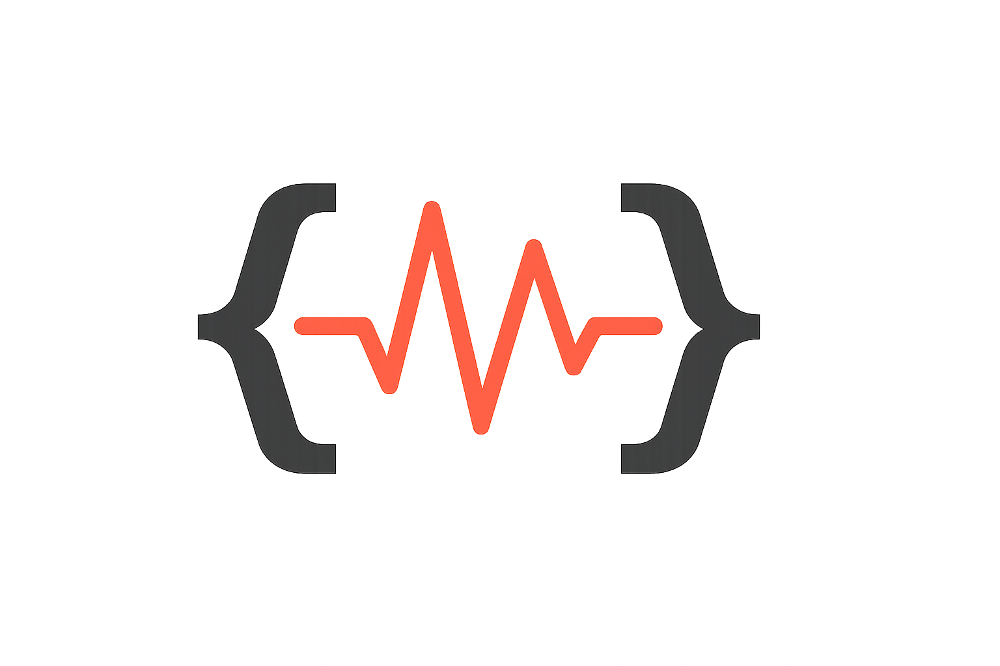

<div align="center">



# ClaudePulse

**Starts each new Claude Pro/Max 5-hour window right after the previous one resets, so the hours you pay for are already running when you sit down to code.**

[](https://opensource.org/licenses/MIT)
[](https://nodejs.org/)
[](https://github.com/substance0/claudepulse/releases)
[](https://github.com/substance0/claudepulse/actions/workflows/docker-edge.yml)

[Quick Start](#quick-start) • [How It Works](#how-it-works) • [Features](#features) • [Installation](#installation) • [Operating](#operating) • [Configuration](#configuration) • [FAQ](#faq-and-troubleshooting) • [Image Tags](#image-tags) • [Support](#support) • [License](#license)

</div>

## At a Glance

Claude's 5-hour windows don't start on their own when the previous one resets. A new window only starts with your first prompt after the reset, and it ends about 5 hours later. If you come back to your desk late, the window starts late too.

> [!WARNING]
> The "5-hour limit" can trigger before 5 actual hours due to token limits or other Claude-specific thresholds. See more details [on Claude's website](https://support.claude.com/en/articles/11647753-how-do-usage-and-length-limits-work).

### Real-World Scenario

| Time         | Without ClaudePulse                                                       | With ClaudePulse                                                          |
| ------------ | ------------------------------------------------------------------------- | ------------------------------------------------------------------------- |
| **9:00 AM**  | Start coding, excited about your project                                  | Start coding, excited about your project                                  |
| **11:00 AM** | _"5-hour limit reached • resets 2pm"_                                     | _"5-hour limit reached • resets 2pm"_                                     |
| **2:00 PM**  | Reset time arrives, but you're in meetings                                | Reset time arrives, but you're in meetings                                |
| **2:10 PM**  | Still in meetings...                                                      | **ClaudePulse sends a pulse automatically**                               |
| **4:00 PM**  | Ready to code, but the window starts NOW<br>_(Lost 2 hours you paid for)_ | Ready to code with **3h remaining**<br>_(Maximum subscription value)_     |

## Quick Start

You need a Claude Pro or Max account, and Docker (or Podman) on a machine that stays on: a NAS, a Raspberry Pi, a small server.

```bash
claude setup-token   # on any machine with a browser; prints a token valid for one year
echo "CLAUDE_CODE_OAUTH_TOKEN=<token>" > claudepulse.env && chmod 600 claudepulse.env
docker run -d --name claudepulse --restart unless-stopped \
  -e TZ=America/New_York --env-file claudepulse.env \
  ghcr.io/substance0/claudepulse:latest
docker logs -f claudepulse   # watch the first pulse
```

That is all: ClaudePulse pulses right away, then follows each window's reset. [Installation](#installation) explains each step and covers Docker Compose and running from source; [Configuration](#configuration) covers work hours and Discord notifications.

## How It Works

1. **A pulse** runs Claude Code once (`claude -p`) on the cheapest model, with thinking disabled, no tools, a one-line system prompt and an isolated configuration, so it is a single short call and costs as little as possible.
2. **Claude Code reports when the current window resets.** ClaudePulse schedules the next pulse just after that time, so one pulse per window is enough.
3. **At startup**, ClaudePulse pulses right away to learn the current window, or waits for `SCHEDULED_START_HOUR` if you set one. Until a window is known, it pulses hourly. With `STATE_DIR` set, a restart or an upgrade resumes the pulse it had planned instead of pulsing again.
4. **Work hours** (opt-in, `WORK_HOURS_ENABLED=true`): the first pulse of each working day lands so the window has the hours you choose left when you start, and a fresh window follows soon after. No pulse is sent at night, on days off, or at startup outside these hours.

See the [workflow diagrams](docs/workflow-diagrams.md) for the full scheduling logic.

### Work Hours: Two Budgets Before Lunch

Say you start at 09:00. Without work hours, your first prompt opens a window that closes at 14:00. With `WORK_START=09:00` and `HOURS_LEFT_AT_START=2`, the first pulse fires at 06:00:10, so at 09:00 that window has 2 hours left, and a fresh one opens at 11:00:


```mermaid
gantt
    title Windows around a 09:00 start, with 2 hours left at start
    dateFormat HH:mm
    axisFormat %H:%M
    section Without ClaudePulse
    Window opened by your first prompt :a1, 09:00, 5h
    section With work hours
    Window 1 opened by the first pulse :b1, 06:00, 5h
    Window 2 opened by the next pulse :b2, 11:00, 5h
    Window 3 :b3, 16:00, 5h
    section You
    You start working :milestone, m1, 09:00, 0m
```

You get two budgets before 14:00 instead of one: the last 2 hours of window 1, then all of window 2. The settings for this example:

```bash
WORK_HOURS_ENABLED=true
WORK_START=09:00
WORK_END=19:00
HOURS_LEFT_AT_START=2
WORK_DAYS=Mon-Fri
```

`WORK_END` is the last moment a window may _start_, not the time you stop working: a window opened before it runs its full 5 hours. If you also work late, in a separate session, set it later (see the [FAQ](#faq-and-troubleshooting)). [ENVIRONMENT.md](ENVIRONMENT.md#work-hours) has the details.

## Features

| Feature                       | Description                                                                                                                         |
| ----------------------------- | ----------------------------------------------------------------------------------------------------------------------------------- |
| **Window-Aware Scheduling**   | Follows the reported window reset, waits out usage limits, and respects a configured start hour ([strategies](docs/workflow-diagrams.md#3-scheduling-strategy-selection)) |
| **Work Hours** (opt-in)       | Starts your working day with a window that has the hours you choose left, so the morning gets two budgets; no pulses at night or on days off ([how](#work-hours-two-budgets-before-lunch)) |
| **Resume After Restart**      | With `STATE_DIR`, a restart or an upgrade resumes the planned pulse instead of sending a new one                                      |
| **Window Notifications**      | Optional Discord message each time a window opens (with weekly usage) or a 5-hour or weekly limit is reached, with reset times in your local time zone |
| **Extra Usage Alert**         | Tells you, in the log and on Discord, when a pulse ran on paid extra usage credits                                                   |
| **Token Expiry Warnings**     | Optional Discord warnings 14, 7 and 1 day before your token expires, and once it has                                                 |
| **Spaced Failure Alerts**     | Optional Discord alerts on the 1st, 2nd, 4th, 8th consecutive failure and so on, so an outage stays visible without flooding the channel |
| **Retry with Backoff**        | Exponential backoff (configurable multiplier and maximum delay) for transient failures; authentication failures are not retried     |
| **Several Accounts**          | One container per account, each named in its log lines and Discord messages ([example](#several-accounts))                          |
| **No Stored Credentials**     | Claude Code authenticates each pulse from `CLAUDE_CODE_OAUTH_TOKEN`; ClaudePulse keeps no credentials, and state only when `STATE_DIR` is set |
| **Small, Verifiable Image**   | No npm runtime dependencies, a pinned Claude Code CLI, `linux/amd64` and `linux/arm64` builds, and signed build provenance         |

## Installation

All installation paths read secrets from a `claudepulse.env` file. Create it once.

**1. Generate a token** on any machine with a browser. It is valid for one year:

```bash
claude setup-token
```

**2. Store it in `claudepulse.env`**, readable only by you. The command prints the token once and saves it nowhere:

```bash
echo "CLAUDE_CODE_OAUTH_TOKEN=<token>" > claudepulse.env && chmod 600 claudepulse.env
```

The env file keeps the token out of your shell history and compose files. Docker still copies its values into the container configuration, so anyone who can run `docker inspect` on the host can read it.

<details open>
<summary><strong>Docker (Recommended)</strong></summary>

```bash
docker run -d --name claudepulse --restart unless-stopped \
  -e TZ=America/New_York \
  --env-file claudepulse.env \
  ghcr.io/substance0/claudepulse:latest
```

Set `TZ` to your [time zone](https://en.wikipedia.org/wiki/List_of_tz_database_time_zones) so log timestamps match your clock (default `UTC`). Podman works the same way: replace `docker` with `podman`.

</details>

<details>
<summary><strong>Docker Compose</strong></summary>

Download the compose file next to `claudepulse.env`, then start it:

```bash
curl -O https://raw.githubusercontent.com/substance0/claudepulse/main/docker-compose.yml
TZ=America/New_York docker compose up -d
```

Settings go in `environment:`; secrets, including the optional Discord webhooks, go in `claudepulse.env`. Values under `environment:` override the env file, so never list a secret there.

</details>

<details>
<summary><strong>From Source</strong></summary>

Requires Node.js 22 or later and the Claude CLI on your `PATH`. There are no runtime dependencies, so no `npm install` is needed to run it:

```bash
git clone https://github.com/substance0/claudepulse.git
cd claudepulse
set -a && . ./claudepulse.env && set +a
npm start
```

Or build and run the image locally: `docker compose -f docker-compose.dev.yml up -d`.

For development setup, tests and the release process, see [CONTRIBUTING.md](CONTRIBUTING.md).

</details>

## Operating

**Check that it works.** A healthy run logs a successful pulse, then the time of the next one:

```bash
docker logs -f claudepulse
# [INFO] [PULSE] Pulse successful (window_resets=…, weekly=20%, cost=…)
# [INFO] [STRATEGY] Strategy selected: window_reset → scheduling next pulse at …
```

`docker ps` also shows a health status. It checks that Node.js and the Claude CLI run, not that pulses succeed; failed pulses show up in the logs and in Discord alerts.

> [!IMPORTANT]
> **Coming from before v2.7.0?** `DISCORD_WEBHOOK_URL` is now `DISCORD_ERROR_WEBHOOK_URL`, and the old name is ignored. Rename it in `claudepulse.env` before you recreate the container, or failure alerts stop reaching Discord:
>
> ```bash
> sed -i.bak 's/^DISCORD_WEBHOOK_URL=/DISCORD_ERROR_WEBHOOK_URL=/' claudepulse.env && rm claudepulse.env.bak
> ```

**Upgrade** to the latest release. With `STATE_DIR` set, the new container resumes the pulse the old one had planned:

```bash
docker pull ghcr.io/substance0/claudepulse:latest
docker rm -f claudepulse   # then run the `docker run` command above again

docker compose pull && docker compose up -d   # with Docker Compose
```

**Renew the token** before it expires, one year after `claude setup-token`. An expired token makes every pulse fail with an authentication error, and it is not retried. Run `claude setup-token` again, replace the token in `claudepulse.env`, update `TOKEN_EXPIRES_AT` if you set it, then recreate the container as for an upgrade. Set `TOKEN_EXPIRES_AT` to the date one year after `claude setup-token` to be warned on Discord 14, 7 and 1 day before, and once it has expired. If "Token rejected" appears right after an upgrade, with a token that has not expired, read the CLI's own error in `docker logs claudepulse` before renewing it: a refusal of the options a pulse runs with is reported the same way.

**Stop** ClaudePulse with `docker rm -f claudepulse`, or `docker compose down`.

## Configuration

Every setting has a default. Pass settings with `-e` or under `environment:`, and secrets through `claudepulse.env`. [ENVIRONMENT.md](ENVIRONMENT.md) documents each one in detail.

### Settings

The ones most setups touch:

| Variable                     | Default       | Description                                                            |
| ---------------------------- | ------------- | ---------------------------------------------------------------------- |
| `TZ`                         | `UTC`         | Time zone for logs, work hours and `SCHEDULED_START_HOUR`              |
| `WORK_HOURS_ENABLED`         | `false`       | Turns work hours on (see [Work Hours](ENVIRONMENT.md#work-hours))       |
| `WORK_START`                 | unset         | When your working day starts (`HH:MM`); required when enabled          |
| `WORK_END`                   | unset         | No window starts at or after this time (`HH:MM`); required when enabled |
| `HOURS_LEFT_AT_START`        | `5`           | Hours left in the window at `WORK_START` (1-5)                         |
| `WORK_DAYS`                  | every day     | Working days, e.g. `Mon-Fri` or `Mon-Thu,Sat`                          |
| `STATE_DIR`                  | unset         | Absolute directory for a state file, so a restart resumes the planned pulse (mount a volume there, e.g. `/data`) |
| `TOKEN_EXPIRES_AT`           | unset         | Token expiry (`YYYY-MM-DD`); warnings 14, 7 and 1 day before, and once expired |
| `ACCOUNT_LABEL`              | unset         | Name shown in log lines and Discord messages, to tell accounts apart   |

<details>
<summary><strong>Advanced settings</strong></summary>

| Variable                     | Default       | Description                                                            |
| ---------------------------- | ------------- | ---------------------------------------------------------------------- |
| `SCHEDULED_START_HOUR`       | unset         | Hour (0-23) of a single first pulse; later pulses follow the window. Not with work hours on |
| `IMMEDIATE_PULSE_AFTER_AUTH` | `true`        | Pulse at startup to learn the current window                           |
| `PROMPT_TEXT`                | `pulse check` | Message each pulse sends to Claude                                     |
| `MAX_RETRIES`                | `3`           | Maximum retry attempts on failure                                      |
| `RETRY_BACKOFF_MULTIPLIER`   | `2`           | Exponential backoff multiplier                                         |
| `MAX_BACKOFF_MINUTES`        | `30`          | Maximum retry delay in minutes                                         |
| `LOG_LEVEL`                  | `INFO`        | Logging verbosity (`ERROR`, `WARN`, `INFO`, `DEBUG`, `TRACE`)          |
| `DRY_RUN`                    | `false`       | Print the schedule and exit without sending a pulse                    |
| `KEEP_PULSE_ON_FAILURE`      | `false`       | Keep the container running when the scheduler fails to start, for debugging |

</details>

### Secrets (`claudepulse.env`)

| Variable                     | Required | Description                                          |
| ---------------------------- | -------- | ---------------------------------------------------- |
| `CLAUDE_CODE_OAUTH_TOKEN`    | yes      | Token from `claude setup-token`                      |
| `DISCORD_ERROR_WEBHOOK_URL`  | no       | Discord webhook for errors and alerts (token expiry, extra usage) |
| `DISCORD_WINDOW_WEBHOOK_URL` | no       | Discord webhook announcing each window's reset time  |

### Discord Notifications (Optional)

ClaudePulse can post to two Discord webhooks:

- **Errors and alerts** (`DISCORD_ERROR_WEBHOOK_URL`, formerly `DISCORD_WEBHOOK_URL`, whose old name is now ignored): failed pulses and other errors, spaced out during an outage, plus token expiry warnings when `TOKEN_EXPIRES_AT` is set, and an "Extra usage in use" alert when a pulse ran on paid extra usage credits. Keep it on a channel you do not mute.
- **Window notifications** (`DISCORD_WINDOW_WEBHOOK_URL`): "Window open" with the reset time and weekly usage, "Usage limit reached" with the time it lifts, "Weekly limit reached" with the date it lifts, or "Extra usage in use" when the pulse ran on paid credits instead. Handy for checking your window from a phone. Give it a channel of its own, so you can mute it without muting error alerts.

To set one up:

1. **Create the webhook**: Discord Server → Settings → Integrations → Webhooks → New Webhook, then copy its URL.
2. **Add it to `claudepulse.env`**. A webhook URL is a secret: anyone holding it can post to the channel.
   ```bash
   echo "DISCORD_WINDOW_WEBHOOK_URL=https://discord.com/api/webhooks/…" >> claudepulse.env
   ```
3. **Recreate the container** so it reads the new value, as for an upgrade.

See [ENVIRONMENT.md](ENVIRONMENT.md#discord_error_webhook_url) to send a test alert.

### Several Accounts

Run one container per account, each with its own env file and label:

```yaml
services:
  claudepulse-work:
    image: ghcr.io/substance0/claudepulse:latest
    container_name: claudepulse-work
    environment:
      - TZ=Europe/Paris
      - ACCOUNT_LABEL=work
    env_file:
      - work.env
    restart: unless-stopped
  claudepulse-personal:
    image: ghcr.io/substance0/claudepulse:latest
    container_name: claudepulse-personal
    environment:
      - TZ=Europe/Paris
      - ACCOUNT_LABEL=personal
    env_file:
      - personal.env
    restart: unless-stopped
```

Both can share Discord webhooks: every message names its account. If you enable `STATE_DIR`, give each container a volume of its own (for example `claudepulse-work-data` and `claudepulse-personal-data`): a state file belongs to one account.

## FAQ and Troubleshooting

**Does a pulse use my allowance?** Very little. A pulse is one short call on the cheapest model, with no tools and thinking off: a few hundred tokens, a few hundredths of a cent at API prices. Each pulse logs its `cost=`.

**What if I work outside my work hours?** Nothing breaks: your first prompt opens a window yourself, as it would without ClaudePulse. `WORK_END` is the last moment a window may _start_, not the time you stop, so a window opened before it runs its full 5 hours. If you also work late in a separate session, set `WORK_END` later: with `09:00`, 2 hours left and `WORK_END=23:59`, a pulse at 21:00:10 opens a window that resets at 02:00, so a session that starts at midnight finds 2 hours left.

**What is "extra usage"?** If your account allows paid extra usage and a limit is reached, Claude Code carries on with credits, and a pulse sent then is billed. ClaudePulse never skips a pulse over it; it tells you with a `Pulse ran on paid extra usage` warning in the log and an "Extra usage in use" message on Discord. The next pulse is planned for when the limit lifts, but a restart without `STATE_DIR`, or the first pulse at `SCHEDULED_START_HOUR`, can add one more before then.

**Is my token safe?** It is read from the environment and masked as `[REDACTED]` in the configuration log, and `claudepulse.env` keeps it out of compose files and shell history. Anyone who can run `docker inspect` on the host can still read it, so keep that host private and renew the token every year.

**Where should it run?** Anywhere that stays on: a NAS, a Raspberry Pi (the images are built for `arm64`), a small server. It needs no Claude login on the machine, only the token.

| You see in the logs or on Discord | It means | What to do |
| --------------------------------- | -------- | ---------- |
| `Outside work hours - no startup pulse; the working day's first pulse is at …` | The container started outside your work hours | Nothing: it waits for the first pulse of the day |
| `Token rejected - run claude setup-token, update claudepulse.env and recreate the container` | The token expired or was refused | Renew it; right after an upgrade, read the CLI's own error in the logs first |
| Failure alerts stopped arriving after an upgrade | `DISCORD_WEBHOOK_URL` was renamed in v2.7.0 | Rename it to `DISCORD_ERROR_WEBHOOK_URL` in `claudepulse.env` |
| `Resuming saved schedule` | `STATE_DIR` is set and the container resumed its planned pulse | Nothing: this is the intended behaviour |
| `Unrecognised rate-limit fields` | Claude Code reports a field ClaudePulse does not know yet | Harmless; open an issue with the line (billing values are masked) |
| `Pulse ran on paid extra usage` | A limit was reached and the pulse used credits | See "What is extra usage?" above |

## Image Tags

Images are published to `ghcr.io/substance0/claudepulse` for `linux/amd64` and `linux/arm64`.

| Tag                           | Published              | Use                         |
| ----------------------------- | ---------------------- | --------------------------- |
| `latest`, `X.Y.Z`, `X.Y`, `X` | when a release is cut  | production                  |
| `edge`, `X.Y.Z-dev.N`         | every commit on `main` | early access to merged work |
| `sha-<commit>`                | every edge and release | pinning an exact build      |

Every image carries signed build provenance. Verify one with:

```bash
gh attestation verify oci://ghcr.io/substance0/claudepulse:<tag> -R substance0/claudepulse
```

Branch snapshots and release rebuilds are covered in [CONTRIBUTING.md](CONTRIBUTING.md#image-builds).

## Support

- [Report bugs or request features](https://github.com/substance0/claudepulse/issues)
- [Environment variables reference](ENVIRONMENT.md)
- [Workflow diagrams](docs/workflow-diagrams.md)
- [Changelog](CHANGELOG.md)

## Contributing

Contributions are welcome! See [CONTRIBUTING.md](CONTRIBUTING.md) for the development setup, checks and release process.

## Disclaimer

ClaudePulse is a personal project, built to learn and experiment with some AI help. It comes with no guarantees, so use it at your own risk. It is independent of Anthropic and not endorsed by it; Claude is a trademark of Anthropic.

## License

This project is licensed under the MIT License - see the [LICENSE](LICENSE) file for details.
