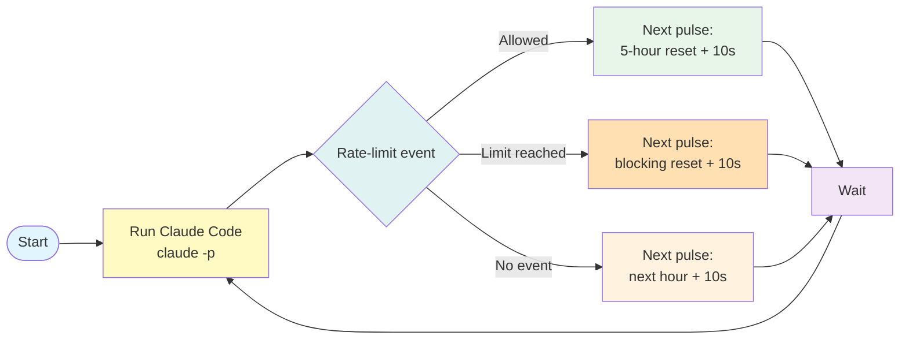
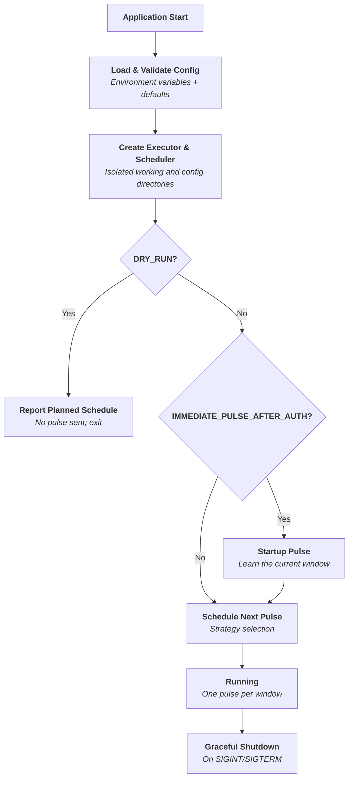
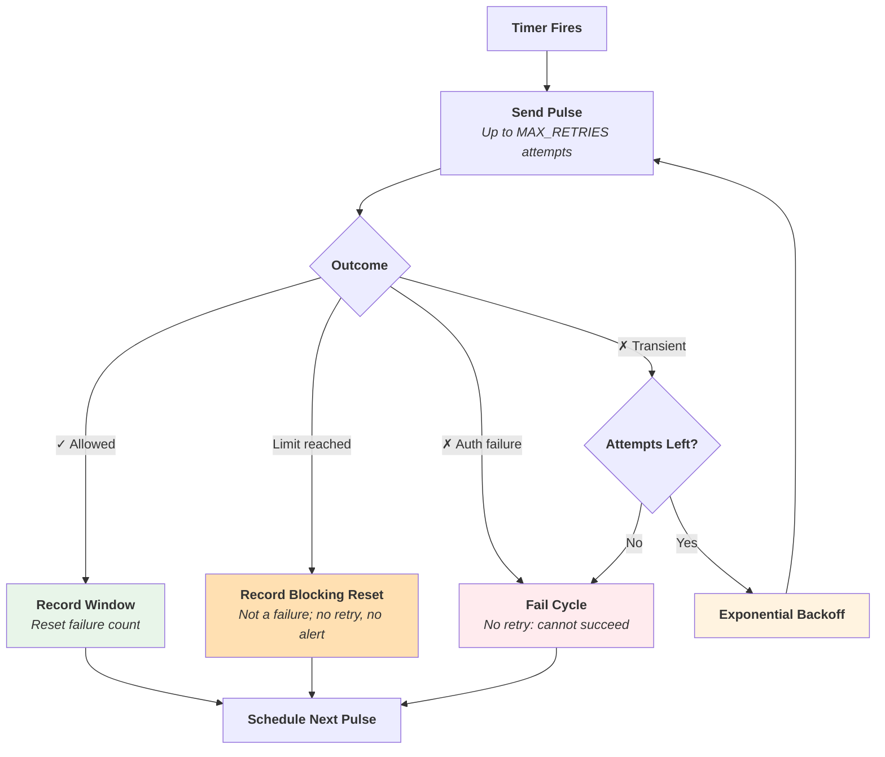
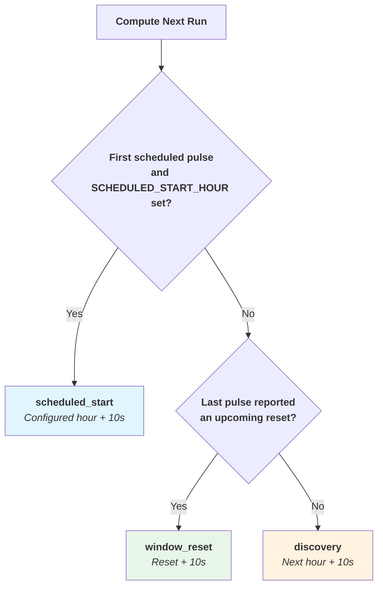
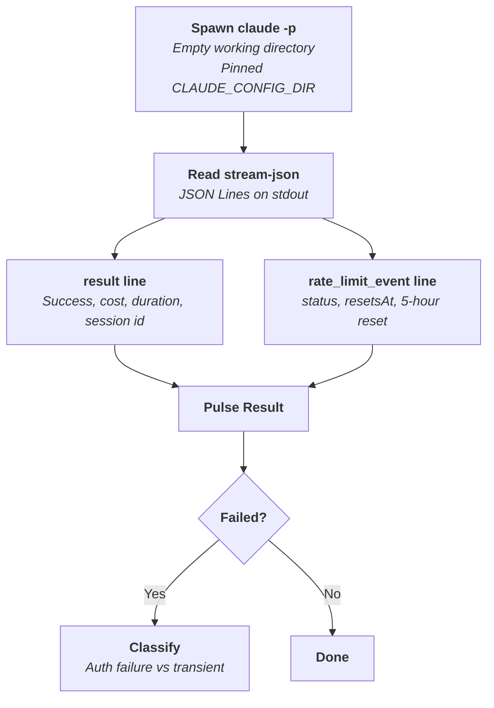
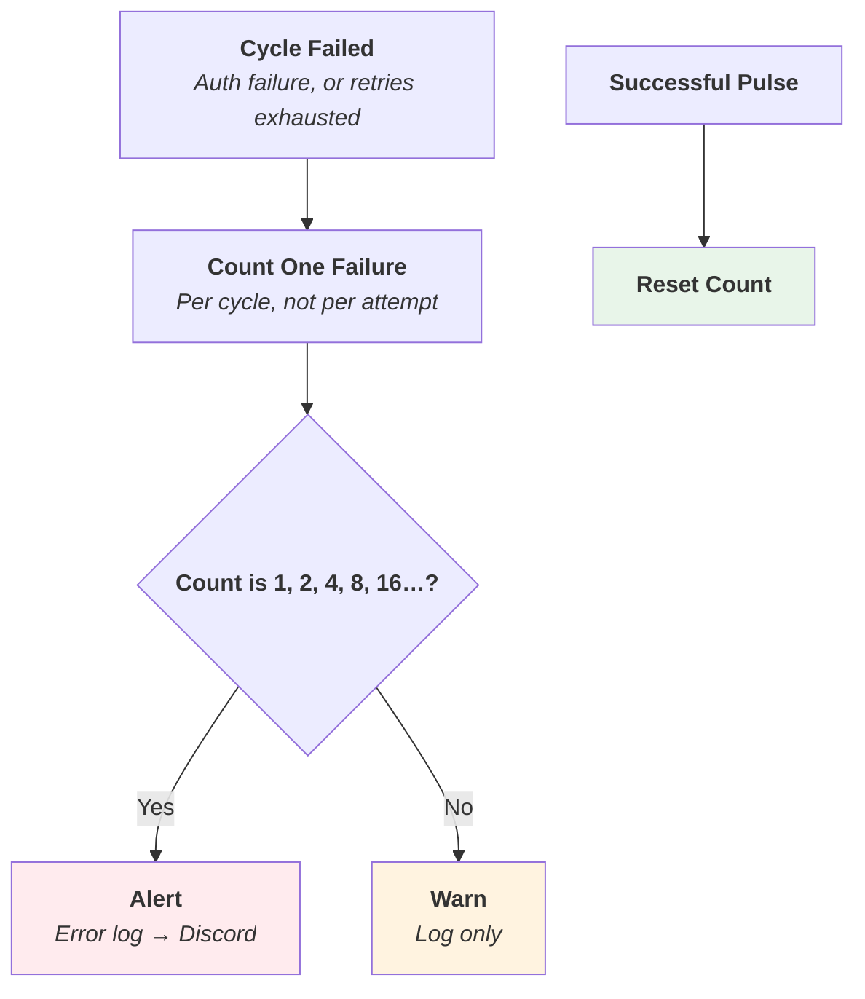
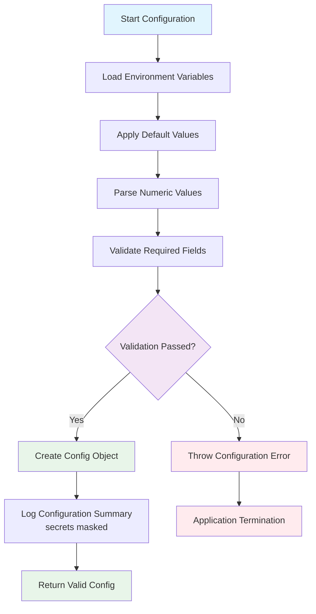
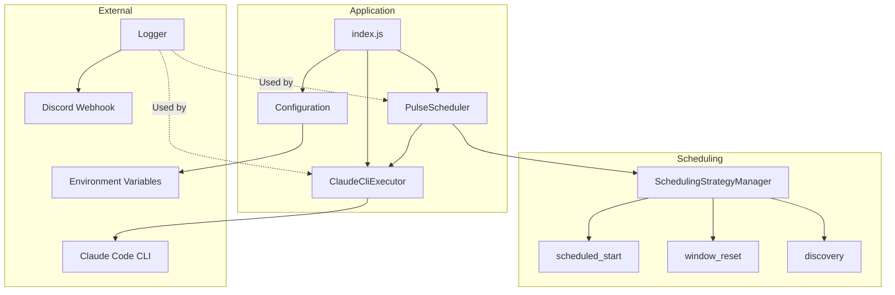

# ClaudePulse Application Workflow Diagrams

This document presents the functional workflows of the ClaudePulse application using Mermaid diagrams.

## System Overview

**Quick understanding:** ClaudePulse keeps your Claude Pro/Max session open by running Claude Code once per usage window, just after the previous window resets.

**Key Points:**

- **Window-driven**: every pulse reports when its window resets, as a timestamp; one pulse per window is enough
- **Stateless**: no credentials, logs or volume; the startup pulse relearns the window after a restart
- **Resilient**: transient failures are retried with backoff; authentication failures and usage limits are not

See detailed workflows below ↓

## Table of Contents

- [System Overview](#system-overview)
- [1. Main Application Workflow](#1-main-application-workflow)
- [2. Scheduler Workflow](#2-scheduler-workflow)
- [3. Scheduling Strategy Selection](#3-scheduling-strategy-selection)
- [4. Pulse Execution](#4-pulse-execution)
- [5. Failure Handling and Alerting](#5-failure-handling-and-alerting)
- [6. Configuration Loading and Validation](#6-configuration-loading-and-validation)
- [Component Overview](#component-overview)
- [Key Design Principles](#key-design-principles)

## 1. Main Application Workflow

There is no authentication step at startup. Claude Code authenticates each pulse itself from `CLAUDE_CODE_OAUTH_TOKEN`. A missing or rejected token shows up as a failed startup pulse, which raises an alert immediately.

## 2. Scheduler Workflow

Scheduling happens in one place. Whatever the outcome, the cycle ends by selecting the next pulse time from the latest rate-limit state.

## 3. Scheduling Strategy Selection

### Strategy Priority Table

Strategies are evaluated in priority order. The first applicable strategy determines the next run time.

| Priority | Strategy          | When Applicable                                       | Next Run Time                  | Example                                    |
| -------- | ----------------- | ----------------------------------------------------- | ------------------------------ | ------------------------------------------ |
| **1**    | `scheduled_start` | `SCHEDULED_START_HOUR` set, first scheduled pulse only | Configured hour + 10sec        | `SCHEDULED_START_HOUR=4` → 04:00:10        |
| **2**    | `window_reset`    | The last pulse reported a window                      | Window reset + 10sec           | Window resets 15:50:00 → 15:50:10          |
| **3**    | `discovery`       | No window known (e.g. a pulse failed)                 | Next hour + 10sec              | Current 13:45 → 14:00:10                   |

**Key Points:**

- **`window_reset`** uses the 5-hour reset after an allowed pulse, and the blocking window's reset after a pulse refused at the usage limit, which may be the weekly one
- Reset times are used as reported, **not rounded to the hour**: windows do not start on the hour
- **`scheduled_start`** is explicit configuration, so it wins for the first scheduled pulse only
- **`discovery`** is a fallback: a single successful pulse is enough to leave it
- All strategies include a 10-second buffer so the pulse lands in the new window rather than racing its boundary

## 4. Pulse Execution

The pulse is built to cost as little as possible: `haiku`, thinking disabled, no MCP servers, no user settings, no session files, and the default system prompt so the prompt cache stays warm. Two options are deliberately never used: `--bare`, which stops the CLI reading `CLAUDE_CODE_OAUTH_TOKEN`, and a custom system prompt, which voids the cache and measured 3.8× more expensive.

## 5. Failure Handling and Alerting

- Alerts are spaced exponentially, so a long outage stays visible without flooding the channel
- Failures are counted per cycle; counting attempts would never land on a power of two with three retries
- A pulse refused at the usage limit is not a failure and never alerts: Claude is in use
- Secrets are masked in the startup configuration log

## 6. Configuration Loading and Validation

## Component Overview

## Key Design Principles

1. **Run the licensed client**: pulses run Claude Code itself; ClaudePulse holds no credentials
2. **Structured over parsed**: the window reset comes from a timestamp in the rate-limit event, not from reading message text
3. **Stateless**: no volume, no logs to scan; a restart relearns the window with one pulse
4. **Cheap pulses**: every flag in the pulse argument list is there to reduce cost, and the cost was measured
5. **Signal, not noise**: expected conditions (usage limits) never alert; real failures alert at spaced intervals
6. **Containerization**: Docker-first approach for consistent deployment
