# ClaudePulse Application Workflow Diagrams

This document presents the functional workflows of the ClaudePulse application using Mermaid diagrams.

## System Overview

**Quick understanding:** ClaudePulse automatically maintains your Claude Pro/Max session by sending periodic pulse messages.

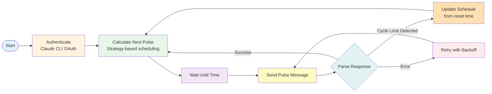

**Key Points:**

- **Adaptive Scheduling**: 1-hour discovery mode → 5-hour normal operation
- **Cycle Limit Aware**: Automatically adjusts schedule when Claude reports "5-hour limit reached • resets 2pm"
- **Resilient**: Exponential backoff, credential watching, state persistence

See detailed workflows below ↓

## Table of Contents

- [ClaudePulse Application Workflow Diagrams](#claudepulse-application-workflow-diagrams)
  - [System Overview](#system-overview)
  - [Table of Contents](#table-of-contents)
  - [1. Main Application Workflow](#1-main-application-workflow)
  - [2. Scheduler Workflow](#2-scheduler-workflow)
  - [3. Scheduling Strategy Selection](#3-scheduling-strategy-selection)
    - [Strategy Priority Table](#strategy-priority-table)
    - [First Run vs Subsequent Run Behavior](#first-run-vs-subsequent-run-behavior)
  - [4. Cycle Limit Handling Workflow](#4-cycle-limit-handling-workflow)
  - [5. Session Tracking Workflow](#5-session-tracking-workflow)
  - [6. Error Handling and Recovery](#6-error-handling-and-recovery)
  - [7. Configuration Loading and Validation](#7-configuration-loading-and-validation)
  - [Master System Architecture](#master-system-architecture)
  - [Component Interaction Overview](#component-interaction-overview)
  - [Key Design Principles](#key-design-principles)

## 1. Main Application Workflow

**Simplified view** - See [Error Handling and Recovery](#6-error-handling-and-recovery) for detailed error flows.

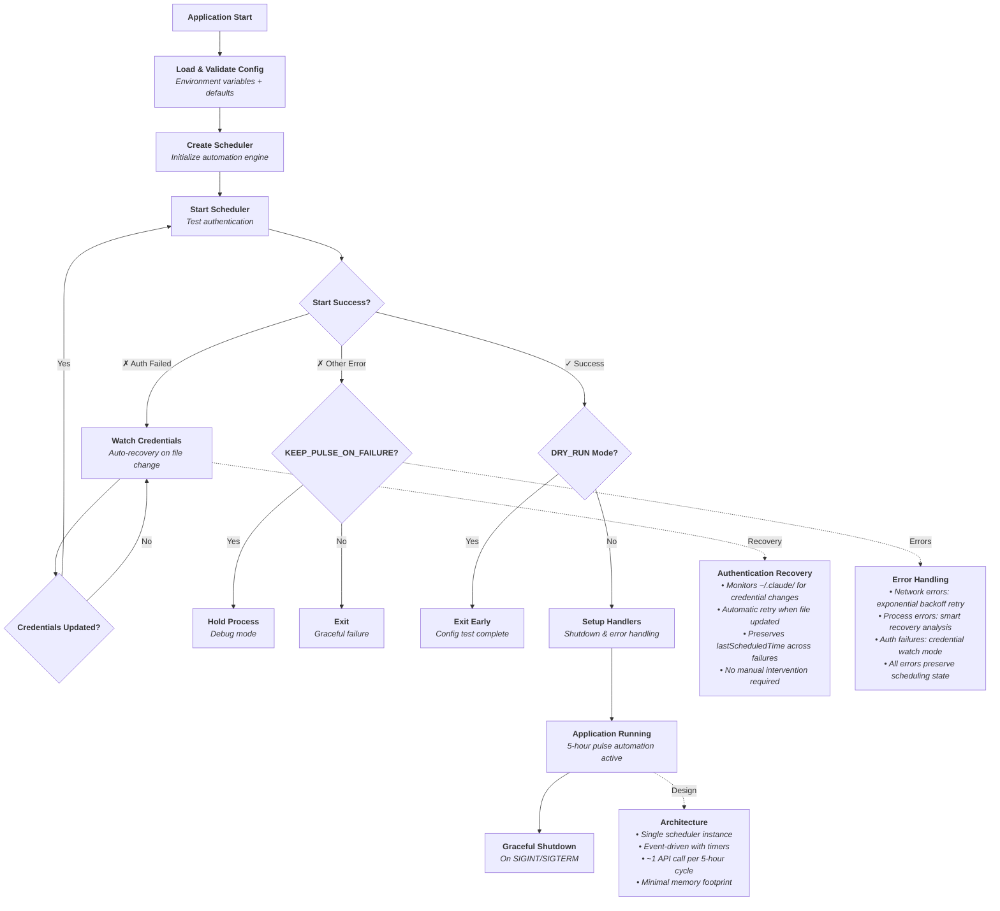

## 2. Scheduler Workflow

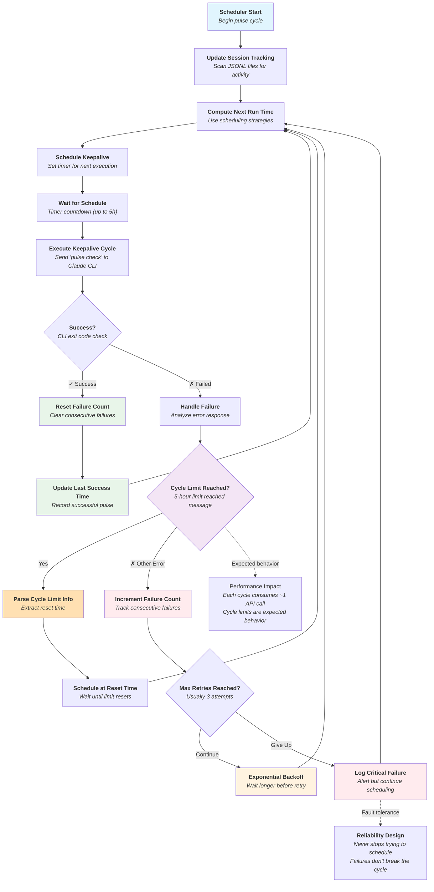

## 3. Scheduling Strategy Selection

### Strategy Priority Table

Strategies are evaluated in priority order. The first applicable strategy determines the next run time.

| Priority | Strategy        | When Applicable                                     | Next Run Time                  | Example                              |
| -------- | --------------- | --------------------------------------------------- | ------------------------------ | ------------------------------------ |
| **1**    | Reset Signal    | Cycle limit message received                        | Reset time + 10sec             | "resets 2pm" → 14:00:10              |
| **2**    | Scheduled Start | `SCHEDULED_START_HOUR` set + no `lastScheduledTime` | `SCHEDULED_START_HOUR` + 10sec | `SCHEDULED_START_HOUR=14` → 14:00:10 |
| **3**    | Active Cycle    | Active session window detected                      | Window end + 10sec             | Active session ends 19:00 → 19:00:10 |
| **4**    | Cruise          | Has `lastScheduledTime` + cycle detected            | Last time + 5 hours            | Last: 09:00:10 → Next: 14:00         |
| **5**    | Discovery       | Fallback (no other strategy applies)                | Next hour + 10sec              | Current: 13:45 → Next: 14:00:10      |

**Key Points:**

- **Reset Signal** (Priority 1) overrides all others when a cycle limit is detected
- **Scheduled Start** (Priority 2) only applies to the **first pulse** when starting fresh
- **Active Cycle** (Priority 3) detects mid-cycle container restarts and schedules at cycle expiry
- **Cruise** (Priority 4) activates after cycle detection, maintains 5-hour intervals
- **Discovery** (Priority 5) continues hourly pulses until cycle limit message received
- All times are in container's local timezone (set via `TZ` environment variable)
- All strategies include a 10-second buffer to ensure pulse happens after time boundary

### First Run vs Subsequent Run Behavior

Understanding the difference between first run and subsequent runs helps clarify strategy selection:

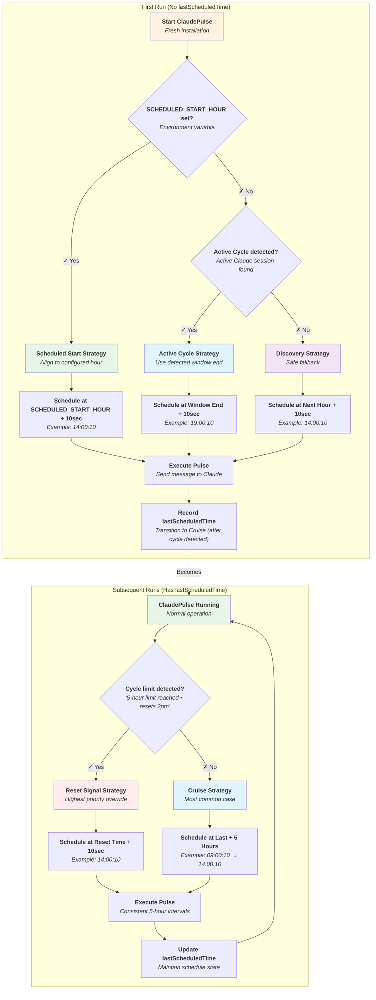

**Key Differences:**

| Aspect               | First Run                                  | Subsequent Runs                       |
| -------------------- | ------------------------------------------ | ------------------------------------- |
| **Primary Strategy** | Scheduled Start / Active Cycle / Discovery | Cruise (every 5 hours)                |
| **Schedule State**   | No `lastScheduledTime` yet                 | Has `lastScheduledTime`               |
| **Behavior**         | Tries to discover current cycle boundaries | Maintains consistent 5-hour intervals |
| **Override**         | Reset Signal only                          | Reset Signal only                     |

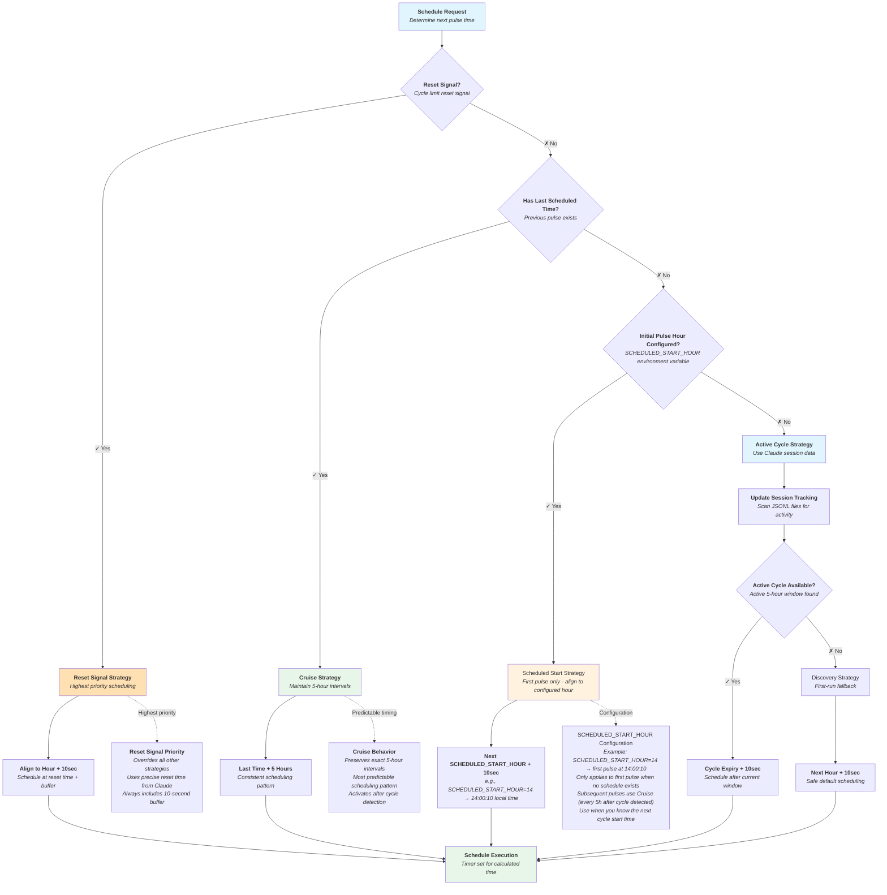

## 4. Cycle Limit Handling Workflow

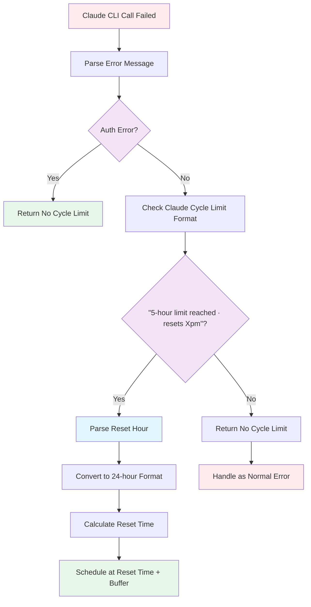

## 5. Session Tracking Workflow

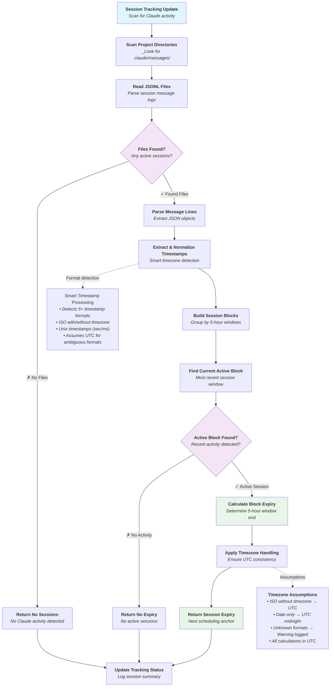

## 6. Error Handling and Recovery

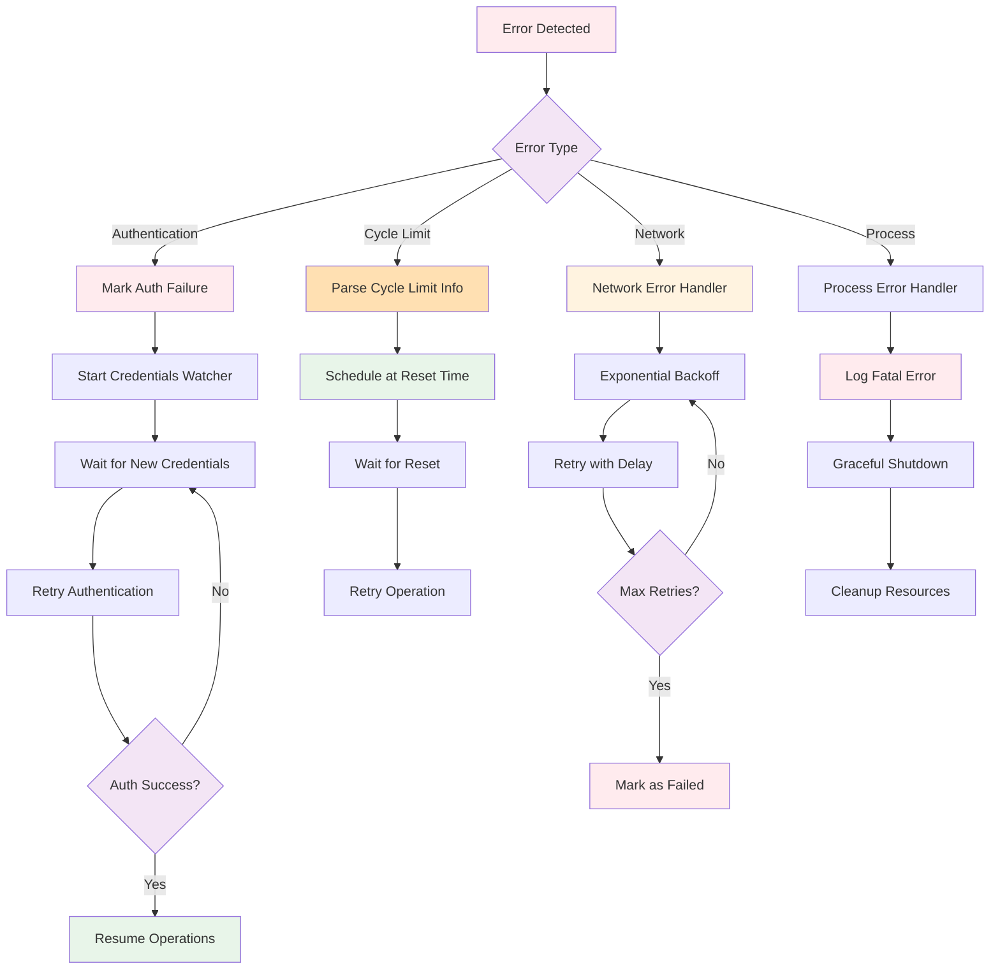

## 7. Configuration Loading and Validation

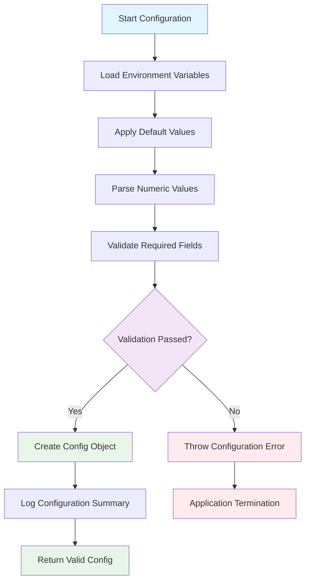

## Master System Architecture

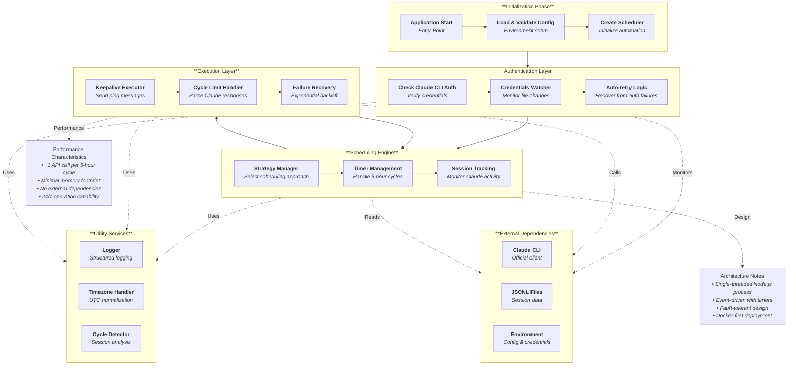

## Component Interaction Overview

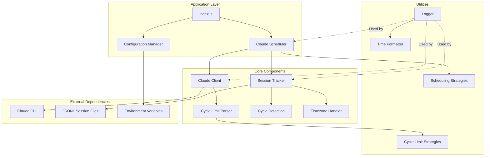

## Key Design Principles

1. **Strategy Pattern**: Both cycle limit parsing and scheduling use strategy patterns for flexibility and maintainability
2. **Error Recovery**: Comprehensive error handling with automatic recovery mechanisms
3. **Session Awareness**: Smart scheduling based on actual Claude session state
4. **State Persistence**: lastScheduledTime preserved across authentication failures to prevent schedule drift
5. **Resource Management**: Proper cleanup and graceful shutdown handling
6. **Observability**: Comprehensive logging throughout all workflows
7. **Containerization**: Docker-first approach for consistent deployment
