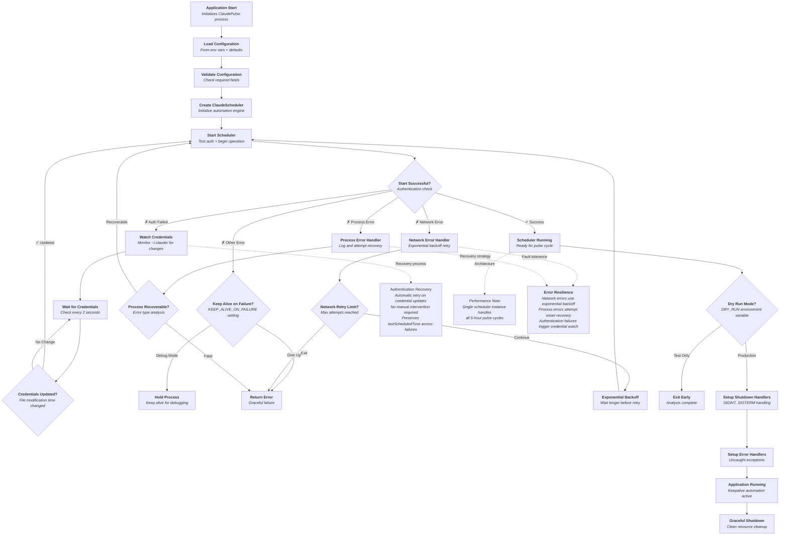
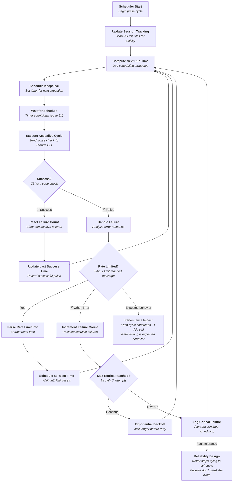
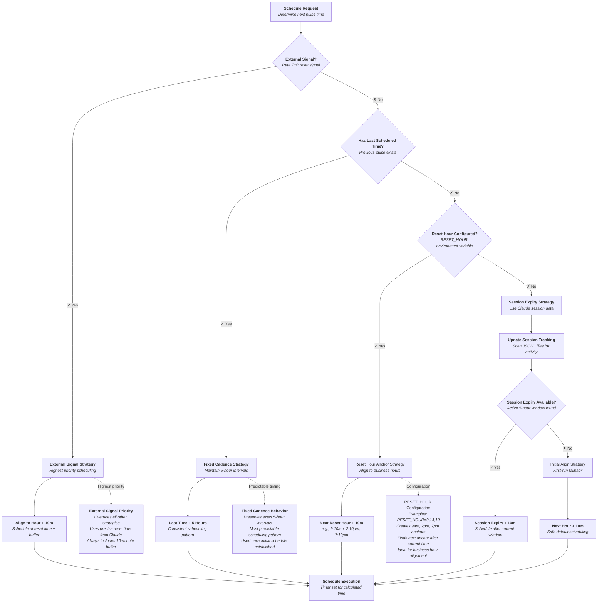
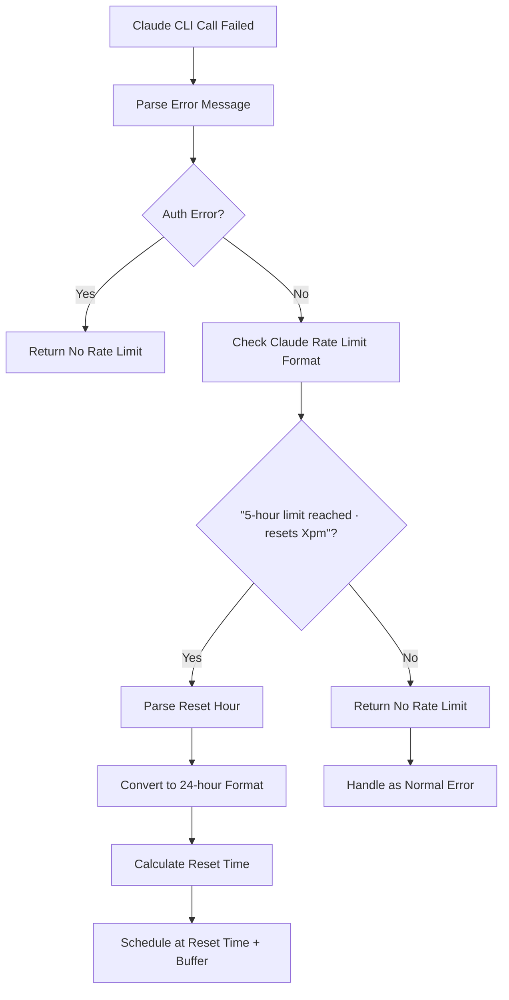
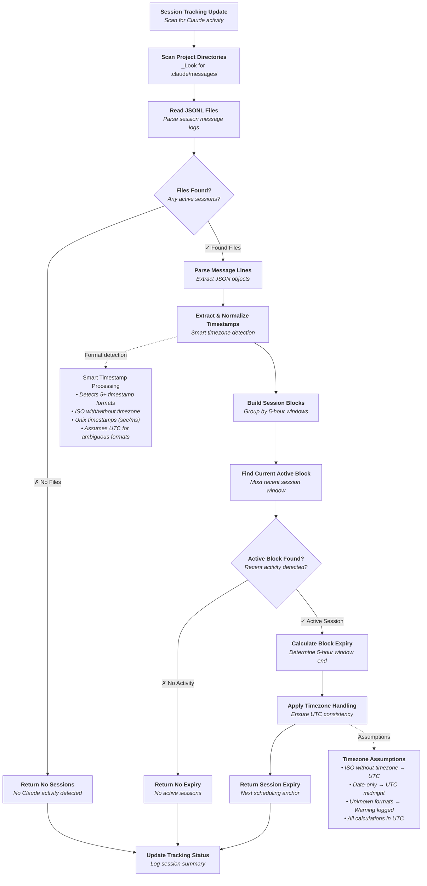
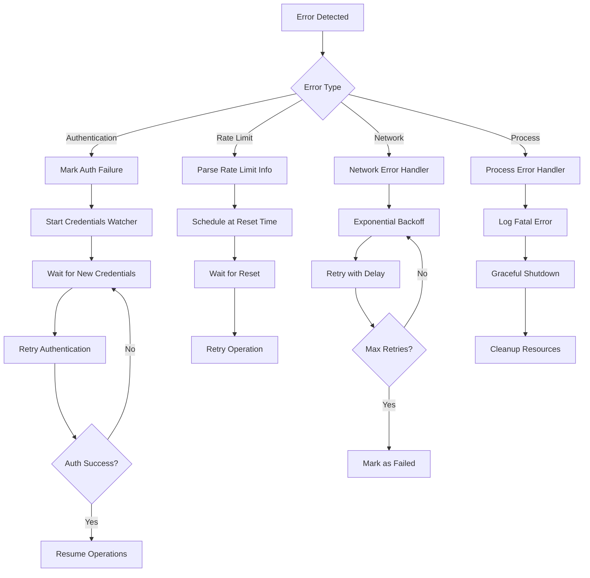
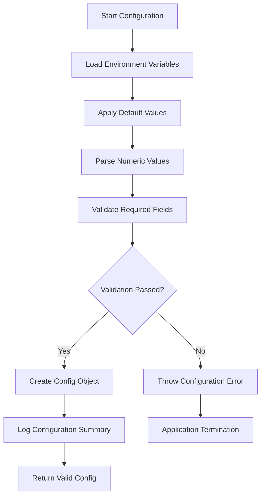
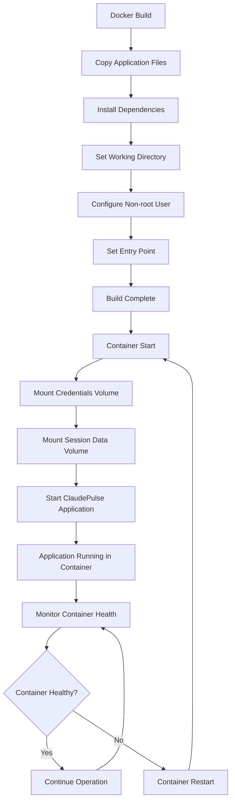
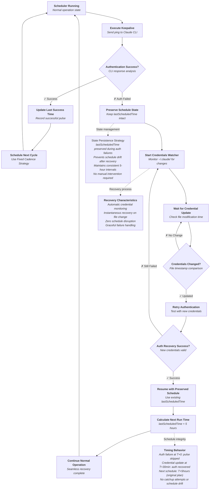

# ClaudePulse Application Workflow Diagrams

This document presents the functional workflows of the ClaudePulse application using Mermaid diagrams.

## Table of Contents

1. [Main Application Workflow](#1-main-application-workflow)
2. [Scheduler Workflow](#2-scheduler-workflow)
3. [Scheduling Strategy Selection](#3-scheduling-strategy-selection)
4. [Rate Limit Handling Workflow](#4-rate-limit-handling-workflow)
5. [Session Tracking Workflow](#5-session-tracking-workflow)
6. [Error Handling and Recovery](#6-error-handling-and-recovery)
7. [Configuration Loading and Validation](#7-configuration-loading-and-validation)
8. [Docker Deployment Workflow](#8-docker-deployment-workflow)
9. [Authentication Recovery and State Persistence](#9-authentication-recovery-and-state-persistence)
10. [Master System Architecture](#master-system-architecture)
11. [Component Interaction Overview](#component-interaction-overview)
12. [Key Design Principles](#key-design-principles)

## 1. Main Application Workflow

## 2. Scheduler Workflow

## 3. Scheduling Strategy Selection

## 4. Rate Limit Handling Workflow

## 5. Session Tracking Workflow

## 6. Error Handling and Recovery

## 7. Configuration Loading and Validation

## 8. Docker Deployment Workflow

## Master System Architecture

## Component Interaction Overview

## 9. Authentication Recovery and State Persistence

## Key Design Principles

1. **Strategy Pattern**: Both rate limit parsing and scheduling use strategy patterns for flexibility and maintainability
2. **Error Recovery**: Comprehensive error handling with automatic recovery mechanisms
3. **Session Awareness**: Smart scheduling based on actual Claude session state
4. **State Persistence**: lastScheduledTime preserved across authentication failures to prevent schedule drift
5. **Resource Management**: Proper cleanup and graceful shutdown handling
6. **Observability**: Comprehensive logging throughout all workflows
7. **Containerization**: Docker-first approach for consistent deployment