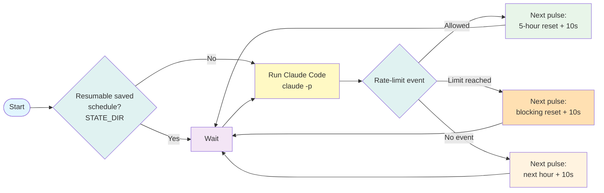
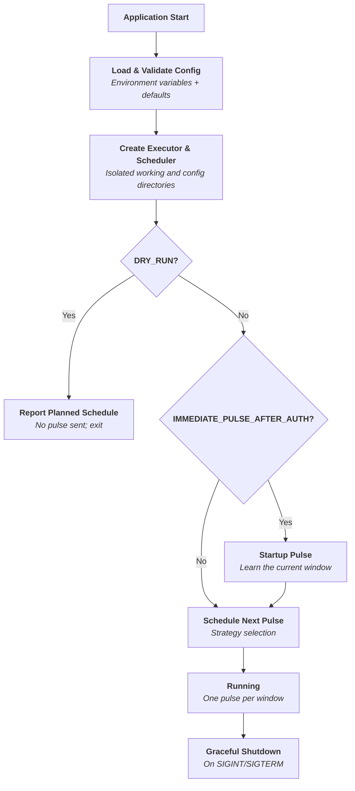
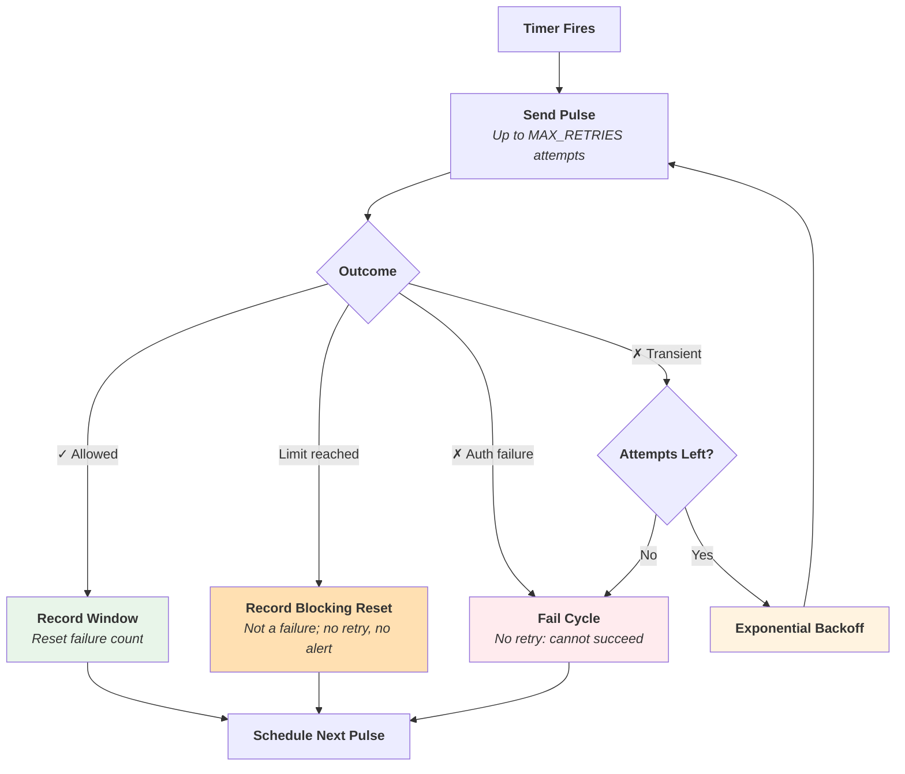
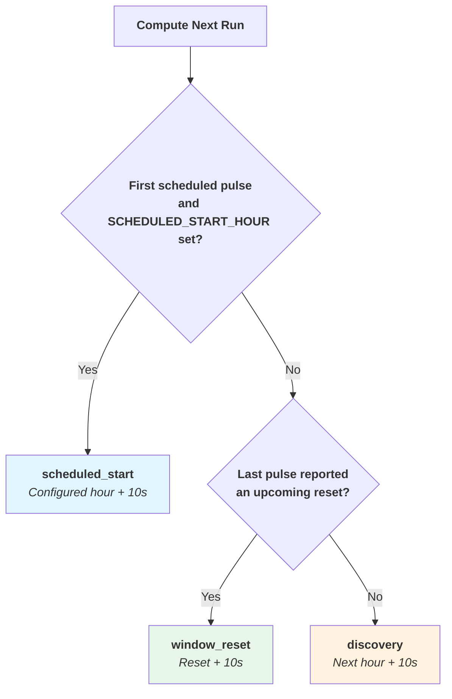
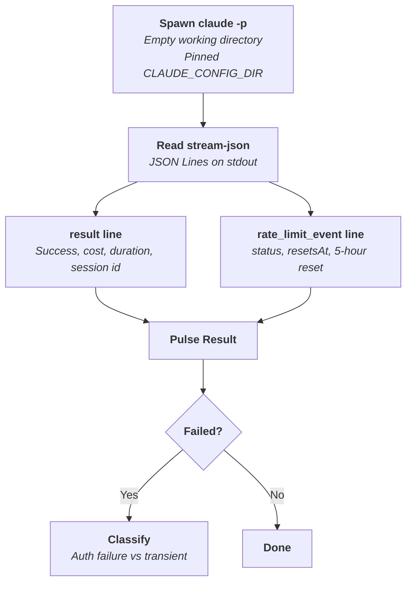
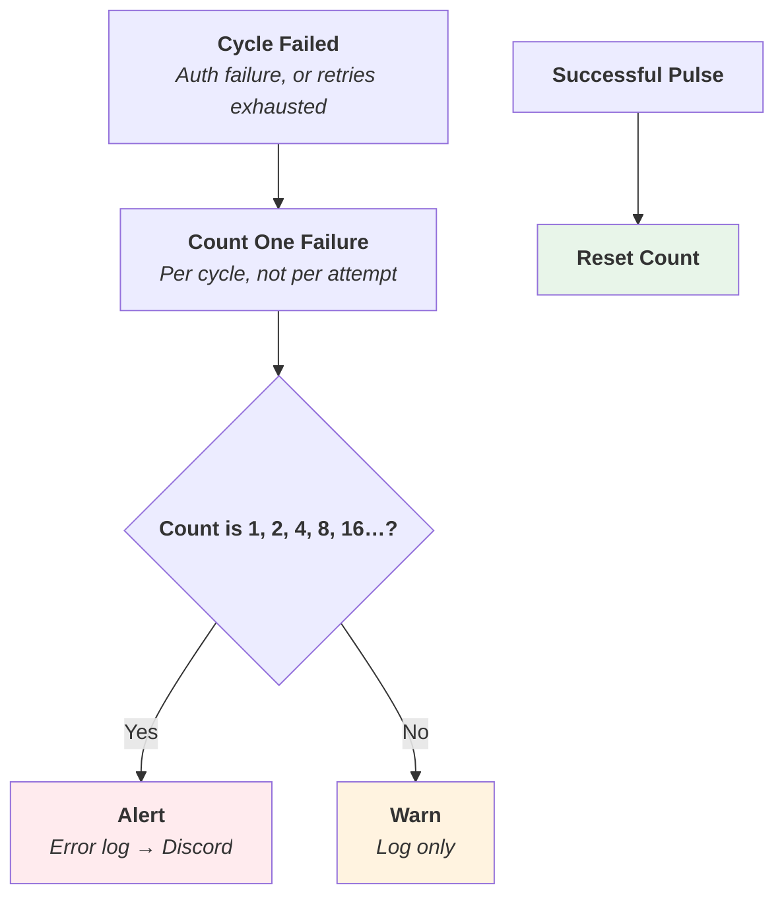
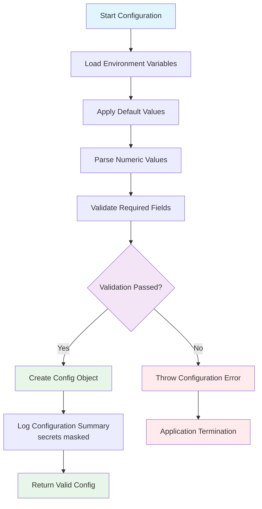
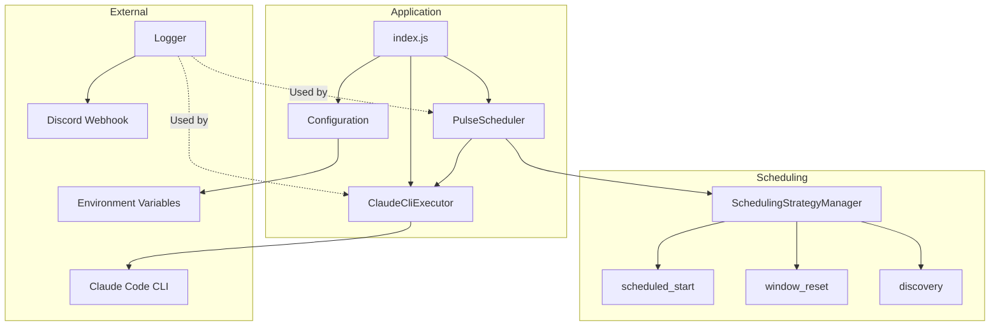

# ClaudePulse Application Workflow Diagrams

This document presents the functional workflows of the ClaudePulse application using Mermaid diagrams.

## System Overview

**Quick understanding:** ClaudePulse keeps your Claude Pro/Max session open by running Claude Code once per usage window, just after the previous window resets.

```mermaid
graph LR
    Start([Start]) --> Saved{Resumable saved<br/>schedule?<br/>STATE_DIR}
    Saved -->|Yes| Wait
    Saved -->|No| Pulse[Run Claude Code<br/>claude -p]
    Pulse --> Read{Rate-limit event}
    Read -->|Allowed| Window[Next pulse:<br/>5-hour reset + 10s]
    Read -->|Limit reached| Blocked[Next pulse:<br/>blocking reset + 10s]
    Read -->|No event| Hourly[Next pulse:<br/>next hour + 10s]
    Window --> Wait[Wait]
    Blocked --> Wait
    Hourly --> Wait
    Wait --> Pulse

    style Start fill:#e1f5fe
    style Saved fill:#e0f2f1
    style Pulse fill:#fff9c4
    style Read fill:#e0f2f1
    style Window fill:#e8f5e9
    style Blocked fill:#ffe0b2
    style Hourly fill:#fff3e0
    style Wait fill:#f3e5f5
```

**Key Points:**

- **Window-driven**: every pulse reports when its window resets, as a timestamp; one pulse per window is enough
- **Stateless by default**: no credentials, logs or volume; the startup pulse relearns the window after a restart. With `STATE_DIR`, the planned pulse is saved and a restart resumes it instead (see "Resuming After a Restart" below)
- **Resilient**: transient failures are retried with backoff; authentication failures and usage limits are not

See detailed workflows below ↓

## Table of Contents

- [System Overview](#system-overview)
- [1. Main Application Workflow](#1-main-application-workflow)
- [2. Scheduler Workflow](#2-scheduler-workflow)
- [3. Scheduling Strategy Selection](#3-scheduling-strategy-selection)
- [4. Pulse Execution](#4-pulse-execution)
- [5. Failure Handling and Alerting](#5-failure-handling-and-alerting)
- [6. Configuration Loading and Validation](#6-configuration-loading-and-validation)
- [Component Overview](#component-overview)
- [Key Design Principles](#key-design-principles)

## 1. Main Application Workflow

```mermaid
graph TD
    A["`**Application Start**`"] --> B["`**Load & Validate Config**
    _Environment variables + defaults_`"]

    B --> C["`**Create Executor & Scheduler**
    _Isolated working and config directories_`"]

    C --> D{"`**DRY_RUN?**`"}
    D -->|"Yes"| E["`**Report Planned Schedule**
    _No pulse sent; exit_`"]

    D -->|"No"| F{"`**IMMEDIATE_PULSE_AFTER_AUTH?**`"}
    F -->|"Yes"| G["`**Startup Pulse**
    _Learn the current window_`"]
    F -->|"No"| H

    G --> H["`**Schedule Next Pulse**
    _Strategy selection_`"]

    H --> I["`**Running**
    _One pulse per window_`"]

    I --> J["`**Graceful Shutdown**
    _On SIGINT/SIGTERM_`"]
```

There is no authentication step at startup. Claude Code authenticates each pulse itself from `CLAUDE_CODE_OAUTH_TOKEN`. A missing or rejected token shows up as a failed startup pulse, which raises an alert immediately. A restart that resumes a saved schedule (`STATE_DIR`) sends no startup pulse, so the first scheduled pulse reports it instead.

## 2. Scheduler Workflow

```mermaid
graph TD
    A["`**Timer Fires**`"] --> B["`**Send Pulse**
    _Up to MAX_RETRIES attempts_`"]

    B --> C{"`**Outcome**`"}

    C -->|"✓ Allowed"| D["`**Record Window**
    _Reset failure count_`"]

    C -->|"Limit reached"| E["`**Record Blocking Reset**
    _Not a failure; no retry, no alert_`"]

    C -->|"✗ Auth failure"| F["`**Fail Cycle**
    _No retry: cannot succeed_`"]

    C -->|"✗ Transient"| G{"`**Attempts Left?**`"}
    G -->|"Yes"| H["`**Exponential Backoff**`"] --> B
    G -->|"No"| F

    D --> I["`**Schedule Next Pulse**`"]
    E --> I
    F --> I

    style D fill:#e8f5e9
    style E fill:#ffe0b2
    style F fill:#ffebee
    style H fill:#fff3e0
```

Scheduling happens in one place. Whatever the outcome, the cycle ends by selecting the next pulse time from the latest rate-limit state.

## 3. Scheduling Strategy Selection

### Strategy Priority Table

Strategies are evaluated in priority order. The first applicable strategy determines the next run time.

| Priority | Strategy          | When Applicable                                       | Next Run Time                  | Example                                    |
| -------- | ----------------- | ----------------------------------------------------- | ------------------------------ | ------------------------------------------ |
| **1**    | `scheduled_start` | `SCHEDULED_START_HOUR` set, first scheduled pulse only | Configured hour + 10sec        | `SCHEDULED_START_HOUR=4` → 04:00:10        |
| **2**    | `window_reset`    | The last pulse reported a window                      | Window reset + 10sec           | Window resets 15:50:00 → 15:50:10          |
| **3**    | `discovery`       | No window known (e.g. a pulse failed)                 | Next hour + 10sec              | Current 13:45 → 14:00:10                   |

**Key Points:**

- **`window_reset`** uses the 5-hour reset after an allowed pulse, and the blocking window's reset after a pulse refused at the usage limit, which may be the weekly one
- Reset times are used as reported, **not rounded to the hour**: windows do not start on the hour
- **`scheduled_start`** is explicit configuration, so it wins for the first scheduled pulse only
- **`discovery`** is a fallback: a single successful pulse is enough to leave it
- All strategies include a 10-second buffer so the pulse lands in the new window rather than racing its boundary
- With work hours on (`WORK_HOURS_ENABLED=true`), the chosen time then moves to the next moment inside working hours, usually the next working day's first pulse; the log then names the strategy `work_hours`

```mermaid
graph TD
    A["`**Compute Next Run**`"] --> B{"`**First scheduled pulse
    and SCHEDULED_START_HOUR set?**`"}
    B -->|"Yes"| C["`**scheduled_start**
    _Configured hour + 10s_`"]
    B -->|"No"| D{"`**Last pulse reported
    an upcoming reset?**`"}
    D -->|"Yes"| E["`**window_reset**
    _Reset + 10s_`"]
    D -->|"No"| F["`**discovery**
    _Next hour + 10s_`"]

    style C fill:#e1f5fe
    style E fill:#e8f5e9
    style F fill:#fff3e0
```

### Resuming After a Restart

With `STATE_DIR` set, the scheduler saves its next planned pulse after every
scheduling decision. At startup it resumes that time, without a startup pulse
and with the log naming the strategy `restored`, only when all of these hold:

- the saved pulse time is still ahead and at most 15 days ahead (a real
  schedule reaches about two weeks at most; a time further out is ignored with
  a warning);
- the scheduling settings (work hours, `SCHEDULED_START_HOUR`,
  `IMMEDIATE_PULSE_AFTER_AUTH`, `ACCOUNT_LABEL`, `TZ`) are unchanged since it
  was saved: a changed setting makes the saved time stale, since it could only
  delay a pulse the new settings want sooner;
- it was based on a known window, not on the `discovery` guess made when no
  window was known (for example after a failed cycle), so a restart with a
  fixed token pulses at once to confirm it works.

Otherwise the startup pulse runs as usual. The resumed time is used once;
every later pulse follows the strategies above. With work hours on, a resumed
time outside them still moves to the working day.

## 4. Pulse Execution

```mermaid
graph TD
    A["`**Spawn claude -p**
    _Empty working directory
    Pinned CLAUDE_CONFIG_DIR_`"] --> B["`**Read stream-json**
    _JSON Lines on stdout_`"]

    B --> C["`**result line**
    _Success, cost, duration, session id_`"]
    B --> D["`**rate_limit_event line**
    _status, resetsAt, 5-hour reset_`"]

    C --> E["`**Pulse Result**`"]
    D --> E

    E --> F{"`**Failed?**`"}
    F -->|"Yes"| G["`**Classify**
    _Auth failure vs transient_`"]
    F -->|"No"| H["`**Done**`"]
```

The pulse is built to cost as little as possible and to be a single short model call: `haiku`, thinking disabled, no tools, a one-line system prompt (`Reply with the single word ok.`), no MCP servers, no user settings and no session files. Two things are deliberately never done: `--bare`, which stops the CLI reading `CLAUDE_CODE_OAUTH_TOKEN`, and replacing the system prompt while keeping the tools, which measured 3.8× more expensive because the tool definitions then miss the prompt cache.

## 5. Failure Handling and Alerting

```mermaid
graph TD
    A["`**Cycle Failed**
    _Auth failure, or retries exhausted_`"] --> B["`**Count One Failure**
    _Per cycle, not per attempt_`"]

    B --> C{"`**Count is 1, 2, 4, 8, 16…?**`"}
    C -->|"Yes"| D["`**Alert**
    _Error log → Discord_`"]
    C -->|"No"| E["`**Warn**
    _Log only_`"]

    F["`**Successful Pulse**`"] --> G["`**Reset Count**`"]

    style D fill:#ffebee
    style E fill:#fff3e0
    style G fill:#e8f5e9
```

- Alerts are spaced exponentially, so a long outage stays visible without flooding the channel
- Failures are counted per cycle; counting attempts would never land on a power of two with three retries
- A pulse refused at the usage limit is not a failure and never alerts: Claude is in use
- Secrets are masked in the startup configuration log

## 6. Configuration Loading and Validation

```mermaid
graph TD
    A[Start Configuration] --> B[Load Environment Variables]
    B --> C[Apply Default Values]
    C --> D[Parse Numeric Values]
    D --> E[Validate Required Fields]
    E --> F{Validation Passed?}
    F -->|No| G[Throw Configuration Error]
    F -->|Yes| H[Create Config Object]
    H --> I[Log Configuration Summary<br/>secrets masked]
    I --> J[Return Valid Config]
    G --> K[Application Termination]

    style A fill:#e1f5fe
    style F fill:#f3e5f5
    style G fill:#ffebee
    style H fill:#e8f5e9
    style J fill:#e8f5e9
    style K fill:#ffebee
```

## Component Overview

```mermaid
graph TB
    subgraph "Application"
        A[index.js] --> B[Configuration]
        A --> C[PulseScheduler]
        A --> D[ClaudeCliExecutor]
    end

    subgraph "Scheduling"
        C --> E[SchedulingStrategyManager]
        E --> F[scheduled_start]
        E --> G[window_reset]
        E --> H[discovery]
    end

    subgraph "External"
        D --> I[Claude Code CLI]
        B --> J[Environment Variables]
        K[Logger] --> L[Discord Webhook]
    end

    C --> D
    K -.->|Used by| C
    K -.->|Used by| D
```

## Key Design Principles

1. **Run the licensed client**: pulses run Claude Code itself; ClaudePulse holds no credentials
2. **Structured over parsed**: the window reset comes from a timestamp in the rate-limit event, not from reading message text
3. **Stateless by default**: no volume, no logs to scan; a restart relearns the window with one pulse, unless `STATE_DIR` saves the schedule
4. **Cheap pulses**: every flag in the pulse argument list is there to reduce cost, and the cost was measured
5. **Signal, not noise**: expected conditions (usage limits) never alert; real failures alert at spaced intervals
6. **Containerization**: Docker-first approach for consistent deployment
